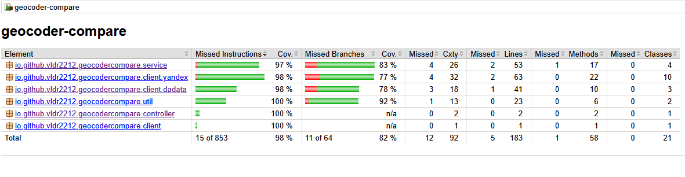

# Geocoder Compare

REST-сервис, который геокодирует один адрес сразу двумя источниками - **Yandex** и **DaData** - параллельно сравнивает их координаты, считает расхождение в метрах, оценивает надёжность результата и сохраняет историю сравнений.

## Технологический стек

- **Backend:** Java 17, Spring Boot 3.5.16 (Web MVC)
- **HTTP-клиент:** Spring WebFlux `WebClient` (вызовы геокодеров)
- **БД:** MySQL 8.4 + Spring Data JPA, миграции через Flyway
- **Документация:** springdoc OpenAPI 3.1 (Swagger UI)
- **Контейнеризация:** Docker, Docker Compose
- **Тесты:** JUnit 5, Mockito, MockWebServer, Datafaker; покрытие - JaCoCo

## Возможности и ключевые решения

- Сравнение адреса двумя геокодерами с уровнями точности `HOUSE / STREET / LOCALITY / NONE`.
- Расстояние между точками источников и флаг надёжности результата.
- Сохранение каждого сравнения с публичным `UUID` для повторного получения.

Решения, на которые стоит обратить внимание:

- **Параллельный опрос источников** через выделенный пул потоков: общее время ответа равно максимуму из двух источников, а не их сумме.
- **Флаг `reliable`** истинен, только если оба источника определили адрес до дома и сошлись в пределах настраиваемого порога расстояния.
- **Расстояние** считается по формуле Haversine, округление до сотых метра.
- **Расширяемость источников:** клиенты работают через общий интерфейс - добавление нового геокодера не затрагивает существующий код.
- **Публичный `public_id` (UUID) отдельно от внутреннего `BIGINT id`** - наружу не утекают последовательные идентификаторы.

## API

Базовый путь - `/api/v1/geocode`.

| Метод | Путь | Описание |
|-------|------|----------|
| `POST` | `/api/v1/geocode` | Сравнить адрес двумя источниками |
| `GET` | `/api/v1/geocode/{publicId}` | Получить сохранённое сравнение по `UUID` |

**Запрос:**

```json
{
  "address": "г Москва, ул Сухонская, д 11"
}
```

**Ответ `201 Created`:**

```json
{
  "requestId": "c53a8f3b-6109-4633-a4b8-aa5814edc848",
  "address": "г Москва, ул Сухонская, д 11",
  "yandex": {
    "latitude": 55.878349,
    "longitude": 37.653694,
    "precision": "HOUSE"
  },
  "dadata": {
    "latitude": 55.878309,
    "longitude": 37.653786,
    "precision": "HOUSE"
  },
  "distanceMeters": 7.26,
  "reliable": true,
  "createdAt": "2026-06-30T18:30:22.060366Z"
}
```

### Поведение и коды ответов

Логика записи в БД и кода ответа зависит от того, сколько источников нашли адрес:

- **Оба нашли** - `201`: считаются `distanceMeters` и `reliable`, результат сохраняется.
- **Нашёл только один** - `422`: частичный результат всё равно сохраняется в БД (для аудита), но `distanceMeters` и `reliable` в ответе нет.
- **Не нашёл ни один** - `422`: в БД ничего не сохраняется.
- **Источник недоступен** (таймаут или сбой) - `502`; этот случай приоритетнее «адрес не найден».
- **Невалидный адрес или некорректный `UUID`** - `400`; запись по `UUID` не найдена - `404`.

Полная спецификация - [docs/api-docs.yaml](docs/api-docs.yaml). **Swagger UI** доступен в dev-профиле: `http://localhost:8080/swagger-ui.html`; в prod-профиле документация отключена.

## Требования

- **Docker** и **Docker Compose** - для основного запуска (больше ничего ставить не нужно).
- **JDK 17** - только для локальной разработки. Maven не требуется: в проекте есть встроенный wrapper (`./mvnw`).

## Запуск через Docker Compose

Поднимает MySQL и приложение (prod-профиль), Flyway применяет миграции автоматически.

```bash
cp .env.example .env   # заполнить значениями
docker compose up -d --build
```

Приложение - на `http://localhost:8080`.

### Переменные окружения (`.env`)

| Переменная | Описание |
|------------|----------|
| `SQL_DATABASE` | Имя базы данных |
| `SQL_USER` | Пользователь MySQL |
| `SQL_PASSWORD` | Пароль MySQL |
| `SQL_PORT` | Порт MySQL (по умолчанию `3306`) |
| `YANDEX_API_KEY` | Ключ API Yandex Geocoder |
| `DADATA_API_KEY` | Токен API DaData |
| `DADATA_SECRET` | Секрет API DaData |

## Локальная разработка

Dev-профиль активен по умолчанию (`ddl-auto: update`, Swagger включён) и ждёт MySQL на `localhost:3306`. Ключи геокодеров берутся из `.env`.

Поднять только БД для разработки (отдельный стек с проброшенным портом):

```bash
docker compose -f docker-compose.dev.yml up -d
```

Запустить приложение (`mvnw.cmd` на Windows):

```bash
./mvnw spring-boot:run
```

## Тестирование

```bash
mvn test
```

Отчёт о покрытии - `target/site/jacoco/index.html`.


